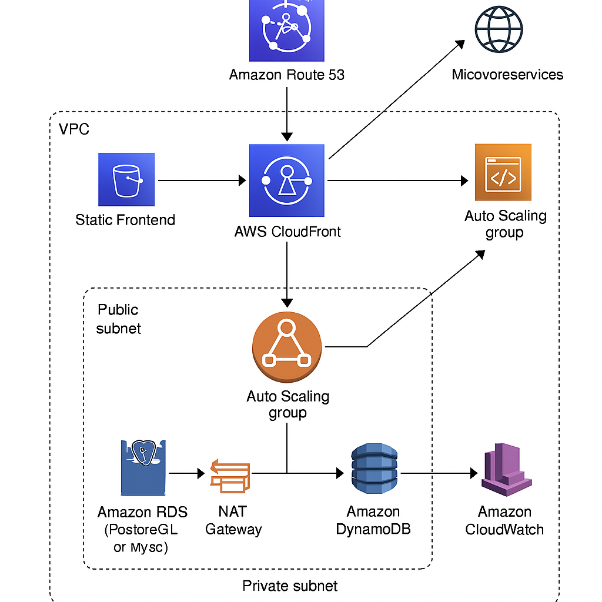

# Prueba Técnica DevOps - Ejecución Local 
Este proyecto contiene una solución completa a la prueba técnica DevOps, completamente funcional en un entorno local usando Docker y GitHub Actions. 



---
 ## ✅ Requisitos 
- Docker: https://www.docker.com/products/docker-desktop 
- Git - Cuenta en GitHub (opcional para probar el CI/CD) 
---
 ## 🧪 Cómo ejecutar el proyecto localmente 
### 1. Clonar el repositorio 
```git clone https://github.com/craftech-inc/devops-interview-ultimate.git cd devops-interview-ultimate ``` 
### 2. Ejecutar los servicios con Docker Compose 
```docker-compose up --build ```
 - Frontend (React): http://localhost:3000 
 - Backend (Django): http://localhost:8000 
 - Base de datos: PostgreSQL en el servicio `db` 
 
 
 ---
 ## ⚙️ Cómo probar el CI/CD (opcional) 
 El directorio `nginx/` contiene un sitio web estático servido por Nginx. Cada vez que modifiques `index.html` y hagas un `git push`, se ejecutará un pipeline automático. 
 ### Pasos: 
 1. Subí el repositorio a GitHub. 
 2. Agregá tus credenciales de Docker Hub como secretos: - `DOCKER_USERNAME` - `DOCKER_PASSWORD` 
 3. Hacé un cambio en `nginx/index.html` y hacé commit + push. GitHub Actions se encargará de: 
 - Build de la nueva imagen de Nginx. 
 - Subida automática a Docker Hub. 
 
 --- 
 ## 📁 Estructura del Proyecto 
 - `backend/`: Django con Gunicorn 
 - `frontend/`: React servido por Nginx 
 - `nginx/`: Sitio estático para CI/CD 
 - `docker-compose.yml`: Orquestador de servicios 
 - `.github/workflows/`: Pipeline CI/CD 
 --- ## 🌐 Simulación de la nube Aunque esta solución se corre localmente, está diseñada para migrarse fácilmente a AWS o GCP. Solo se debe adaptar el despliegue (ECS, Cloud Run, GKE, etc.).